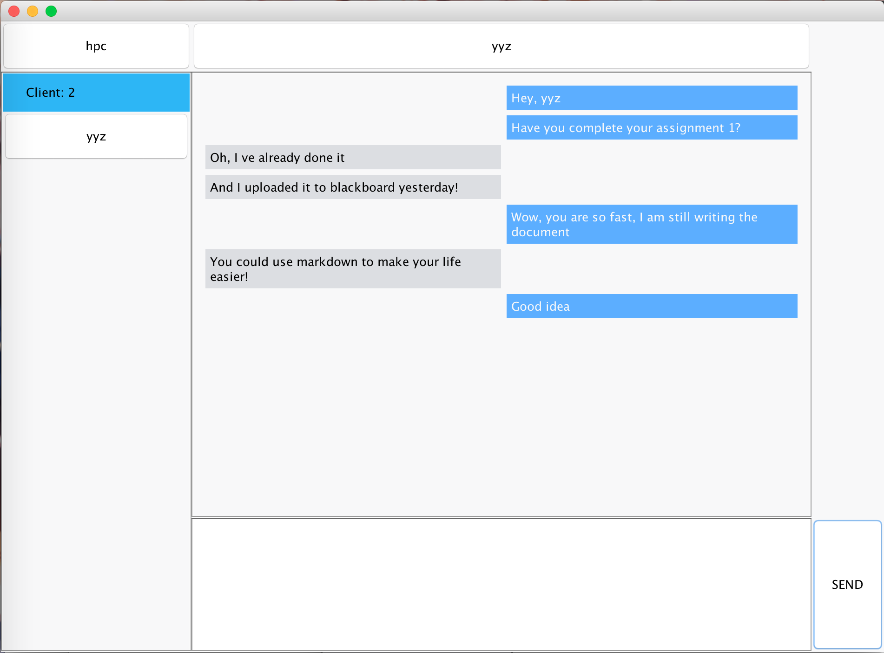
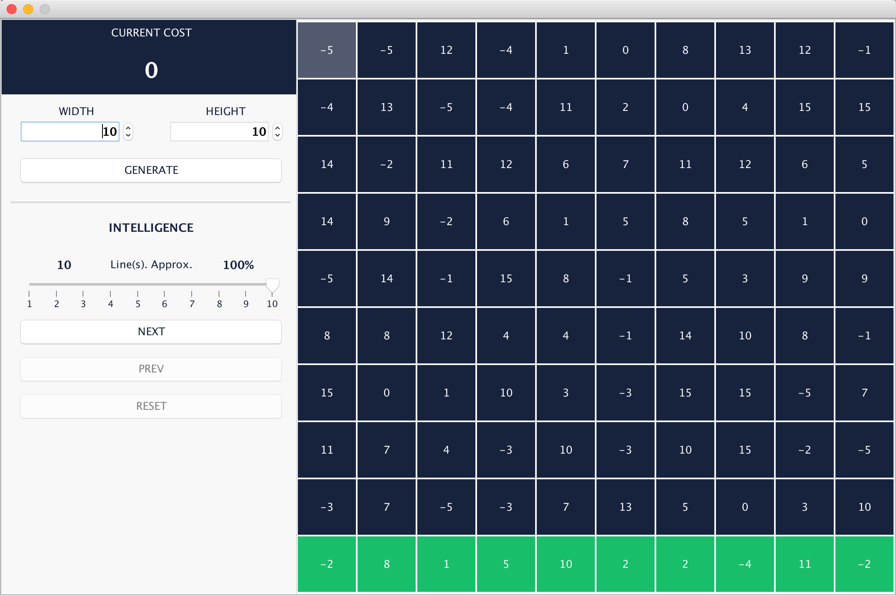
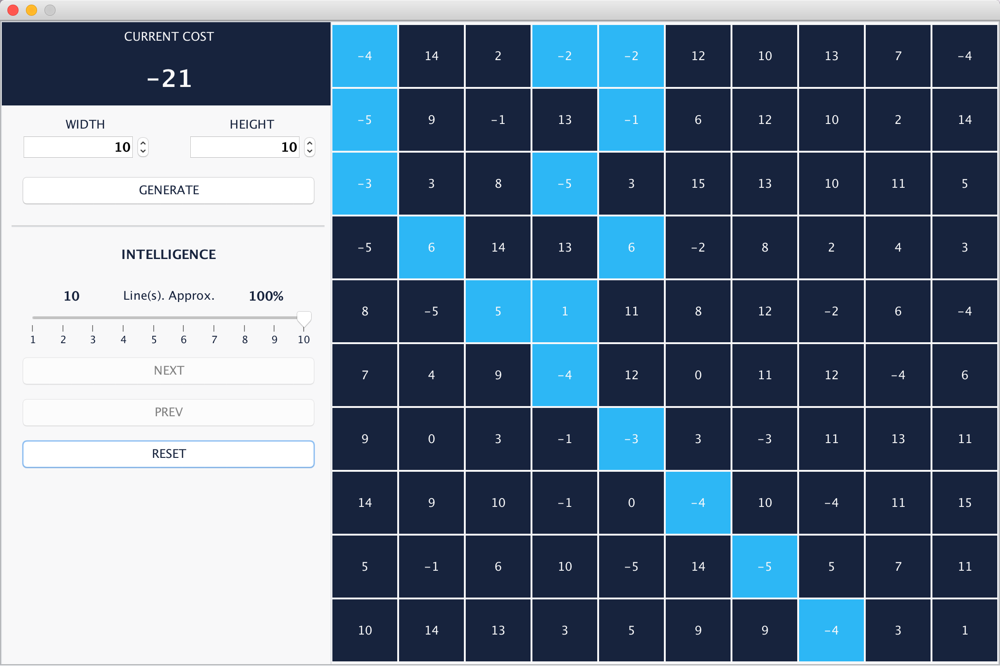
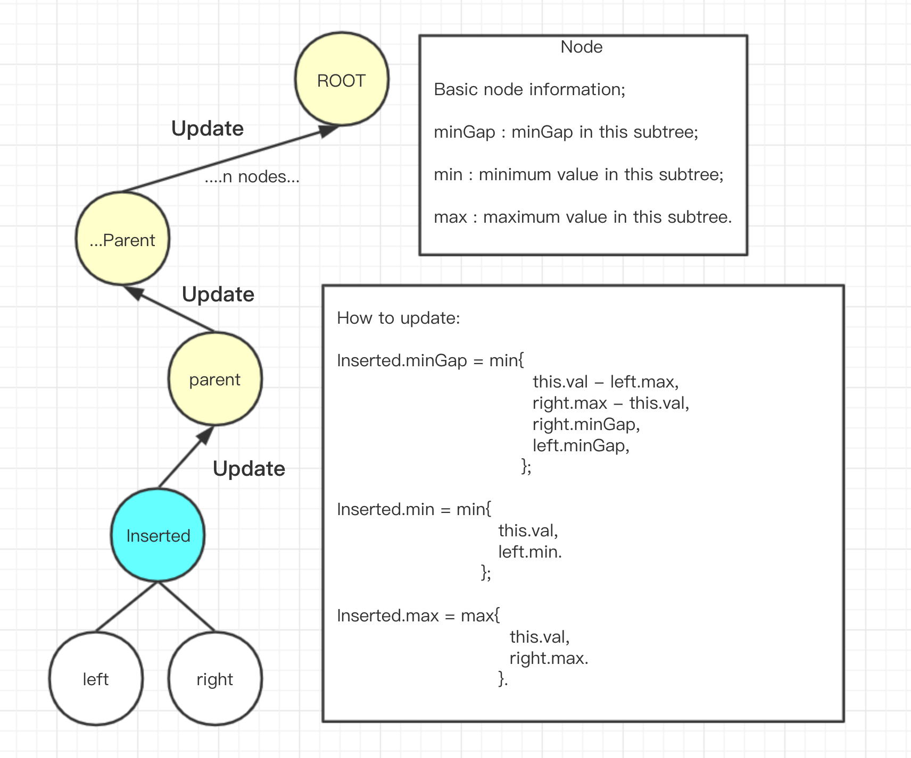
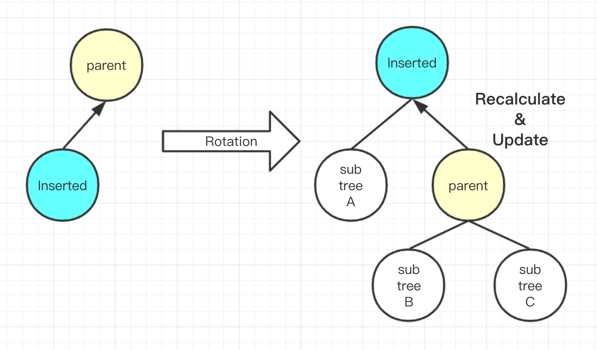

# AUT-COMP611-Algorithm Design and Analysis 2019

### Please do not copy my work. Thanks.

## Assignment 1 - Chatroom

## Assignment 2 - Find the shortest path in a terrain

## Assignment 3 - Graph, Tree & Augmented DS

#### **MinGap**

## Assignment 4 - Independent studied algorithm

#### A calculator utilizing KNN Handwriting Digits recognition.

