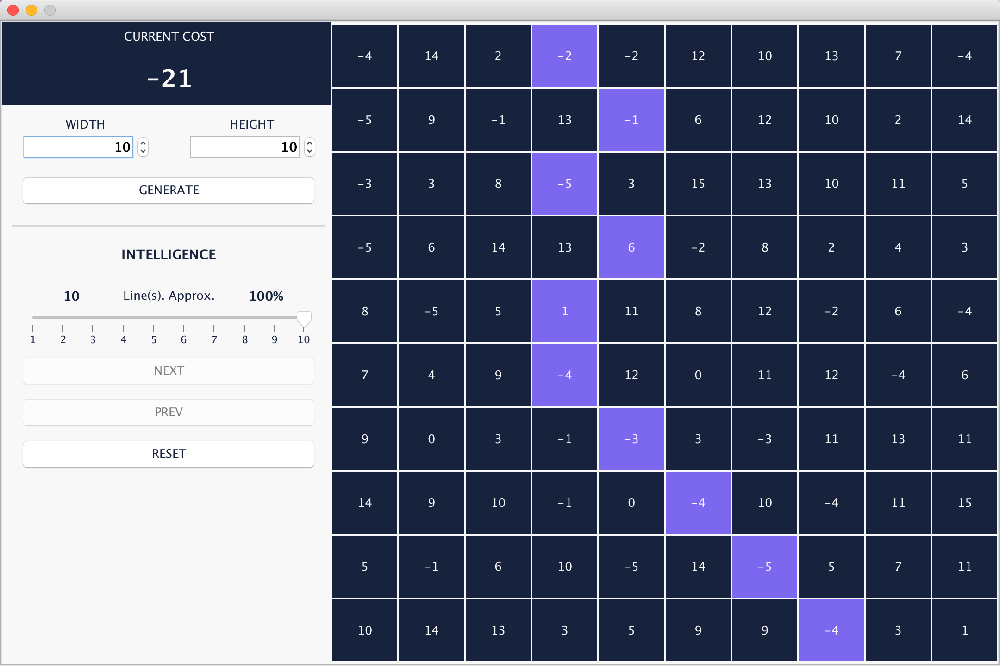
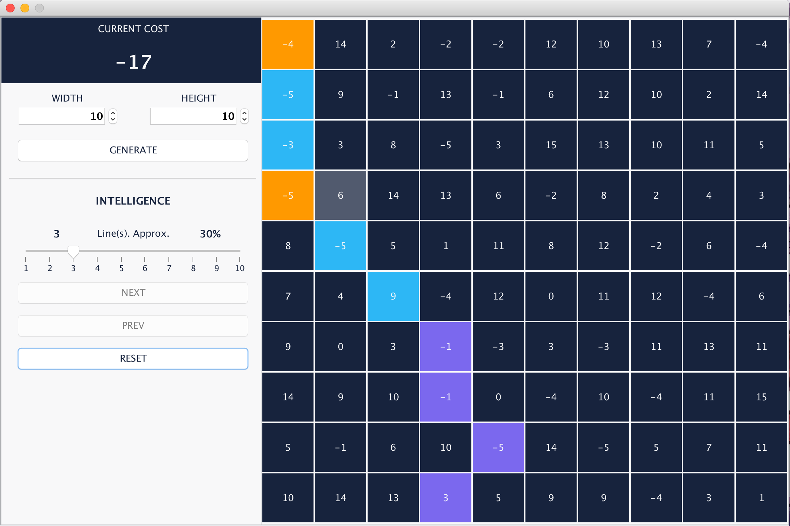

# Brief Introduction

### Functionalites

- GENERATE

  - You can manually set the size of terrain by specifying its ***width*** and ***height***.
  - By clicking the **GENERATE** button, a new terrain will be generated.

- INTELLIGENCE

  - When automatically searching for the shortest path, you can assign a ***intelligence value*** by sliding the **slider**. The value of **slider** is between ***1*** to the ***height of terrain***. 
  - Like the example in image above, when ***intelligence value*** are assigned with a maximum ***10***, which means 100% intelligence, then the program will find the shortest route directly.
  - If the intelligence are below 100%, the program can only make decisions based on the number of rows equal to the value of intelligence.

- NEXT

  - By clicking the **NEXT** button, the program will automatically find the route for you. 
  - If the intelligence are below 100%, you may click it multiple times.
  - In this program, you can use automatic mode and manual mode together. Like the one in the last image in this document.

- PREV

  - You can undo **manual** decisions by clicking the **PREV** button.

- RESET

  - If you want to play with the same terrain for multiple times, you can click **RESET** button to clear your current approach.
  - Like if you want to test the difference between different intelligence level, you can use this functionality.

  

### Label Colors

##### Purple

- Manual decisions are marked as purple.

##### Blue

- Automatic decisions are marked as Blue and Orange.

##### Orange

- When the ***intelligence*** is in a lower level, the program have to make decision multiple times. And each **automatic** decision will find a shortest path node. This node will be set to Orange.
- Each decision are made based on the former Node with the shortest path.

