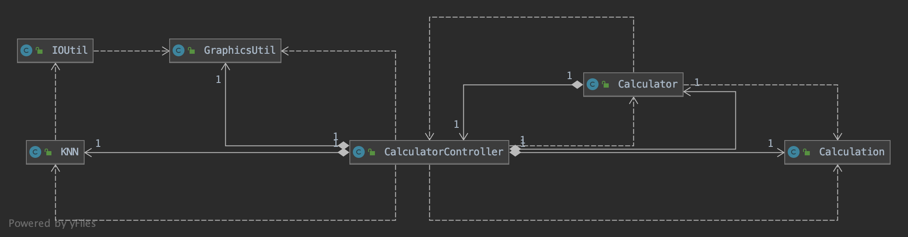

# Assignment 4

## Description

- Application
  - An calculator that utlizing handwriting digits recognition.
  - Concepts utilized ( not easy to tell what exactly being used )
    - Patterns
      - Singleton pattern
      - Observer pattern
        - MVC
      - Perhaps the Facade, but not as authentic.
- Algorithm
  - A basic Machine Learning algorithm, the K-Nearest Neighbor, KNN.

## Directory Structure

- src
  - assignment_4
    - Controller
      - **CalculatorController.java**
      - ~~SampleController.java~~
    - Model
      - **Calculation.java**
      - Constants.java
      - KNNInfo.java
      - Outline.java
    - View
      - Components
        - Display.java
        - OperatorLabel.java
        - SketchpadPanel.java
      - Windows
        - **Calculator.java**
        - ~~SampleView.java~~
    - Util
      - GraphicsUtil.java
      - IOUtil.java
      - KNN.java
    - Test
      - ***CalculatorTest.java***
    - TrainingSet
      - 0 - 9. Txts	
- ReadMe.pdf

## How to use

#### Run the project

1. Import the project following the directory structure, put the **assignment_4** folder under **src**.
2. Run the ***CalculatorText.java*** in **Test** package.

**Note:** Launching the application need a 2-3 seconds wait for KNN to load samples.

#### User Guide

1. The **dark grey** area is for handwriting recognition. You can draw 0 - 9 on it, once the **Recog** **button** being pressed, the digit will be recognized and put onto the display like Image 2. Try to write gently, since the accuracy is not high enough (will explain later).

2. If you input something wrong, you can press the **Backspace or Del** on keyboard. Or if you draw something wrong, click the **Clear button**.

3. Digits you drew will not be automatically cleaned after being recognized, so that you can input it multiple times be click **Recog** without draw a new one. 

4. When you attempt to draw something new after the former being recognized, the sketchpad does clear automatically for you once you start to paint.

5. You can also input number from the keyboard.

6. Operators available can be clicked, or input from your keyboard.

7. Once the formular is completed, press **= button** to calculate result, or you can press **Enter or =** on the keyboard. And the result will be printed.

   

8. If you input something wrong, the display will turn red and warn you. 

9. if you attempt to divid by zero or anything unable to calculate, an **Infinity or NaN** will be printed. You have to press **AC** to restart.

   

## Algorithm Explanation 

### KNN

#### 	Explanation

- Calculate the distance among input and each element in the training set (labeled).

- Find the K nearest elements

- Find the major class among the K elements.

  

#### 	pseudocode

- int[400] input; 
- int k = 4; 	// User decides.
- List<List<int[]>> labeledTrainingSet;
- List\<KNNNode> KNNInfo;
- **// Calculate the distance among each trainingSample**
- for (List<int[]> aClass : labeledTrainingSet)
  - for (int[] sample : aClass) 
    - // labeledTrainingSet.index( aClass )is the sequence of this list in labeledTrainingSet, which indicates the class of 0 - 9.
    - int class = labeledTrainingSet.index( aClass );
    - int dist = euclideanDistance( input, sample );
    - KNNNode node = { class, dist };
    - KNNInfo.add( node );
  - End for-loop
- End for-loop
- **// Sort the list based on the distance of each KNNNode, put smaller to the front (ASC).**
- KNNInfo.sort( KNNNode.dist, 'ASC' );
- // Get the first K KNNNodes in the list.
- List\<KNNNode> kNode = KNNInfo.getFirstK( K );

- **// Find the major class among kNode**
- // A array that contains the number of sample of each class among K KNNNodes.
- double[ 10 ] votePool;
- // This part does not belong to a standard KNN procedure, 
- // but I found it could improve the accuracy by adding **avg / KNNNode.dist** to the **votePool** than simply adding **1**;
- double avg;
- for (KNNNode node : kNode)
  - avg += node.dist;
- End for-loop
- avg = avg / kNode.length;
- // calculate the weight of each class.
- for (KNNNode node : kNode)
  - votePool[ kNode.index( node ) ] += avg / node.dist
- End for-loop
- **// The index of the largest number in votePool is the majorClass.**
- int majorClass = Maximum ( for votePool );

### Accuracy

- Final version K = 4;
- The accuracy may increase if the PCA is applied before KNN for it can filter irrelevant informations. But manipulating matrices in Vanilla Java without the help of any external packages took me too much effort, so I gave up.
- Even though a large amount of training sample are contained, the real usage may not match the tested accuracy since there are still differences between what we write using trackpad or mouse and the one we write on paper. And the handwriting differ from region to region.

- The accuracy was measured by dividing training set ( 35000 samples selected ) into 2 sets, one for test.

- Graph 1
  - There is a significant accuracy drop when K > 10.
  - When K = 6 result in a better average accuracy as well as the highest recognized rate of Digit 8.

- Graph 2
  - Later I found that even though the cloest element is in the right class, the mojor class voted was another. And the two has nearly the same weight. So I figure out a simple way to improve accuracy little bit:
    - When voting the major class, instead of increasing the corresponding class weight always by 1, we calculate the average distance among the K elements, and each time plus the weight by the value of AVERAGE / DISTANCE, as described in the pseudocode, which decrease the significance of farther elements.
  - Graph label explanation:
    - Number -- always add 1
    - Number AVG -- add AVG/DIST
    - Number AVG@2 -- (AVG/DIST)^2
  - When applied the 'avg method', the accuracy slightly increased except when k = 4. But when K = 4 without AVG, the accuracy of 8 is significantly low, so we won't consider that.
  - In consideration of the accuracy of the lowest two, the 8 and 2, I chose K = 4 with AVG/DIST;

- A relatively high accuracy, if draw digits gently. 

- Hint: To avoid writing 8 too fat, or it is likely to result in a 3.

  

## UMLs

#### Dependency Diagram among **Major** Classes

- These are the major classes, some tiny one are not in this diagram.

#### 

#### Activity Diagram 1 - KNN Handwriting Digit Recognition

.png)

#### Activity Diagram 2 - Calculator

- Since most events are handled by Observer pattern, I believe there is no need to explain, like how the calculator works.
- The calculation part is supported by ScriptEngine, since we have already implemented a Calculator 2 years ago, and its time consuming.

.png)